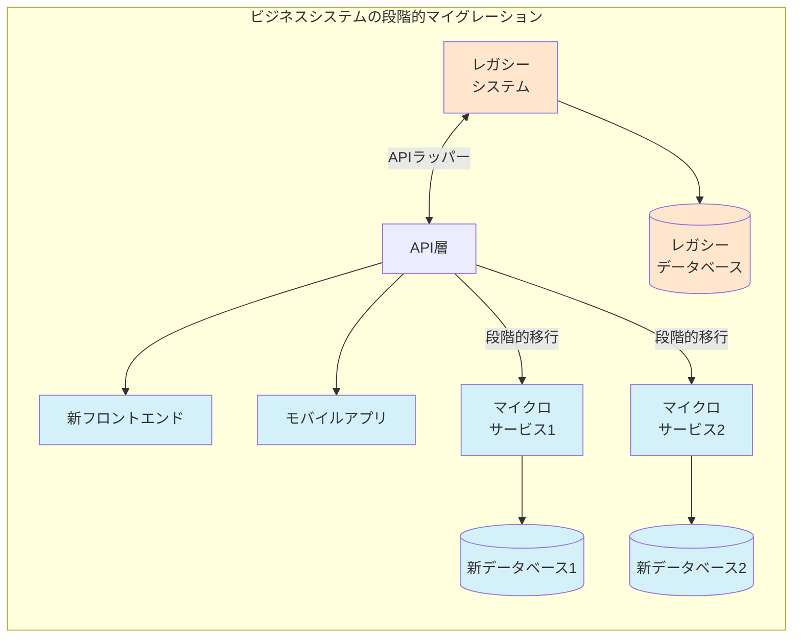
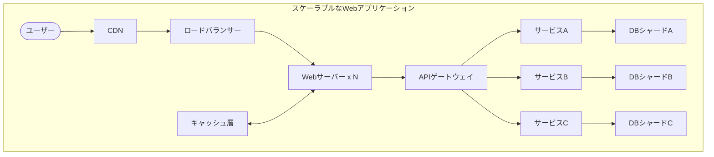
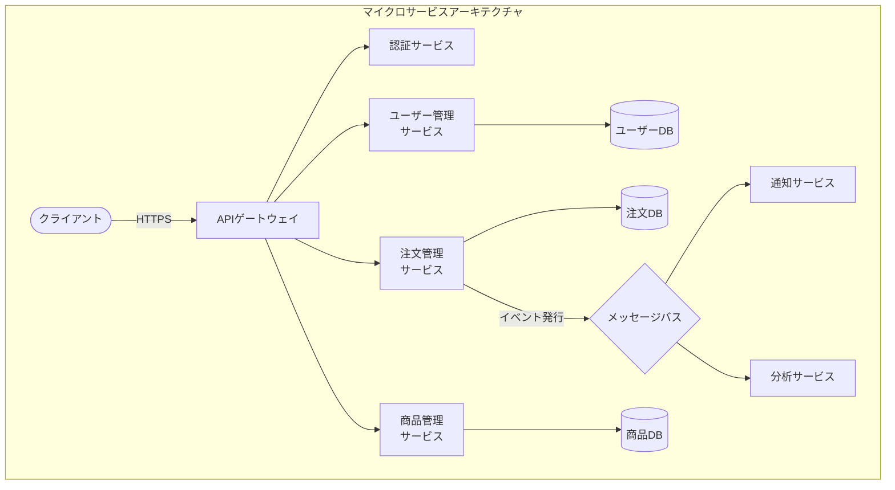
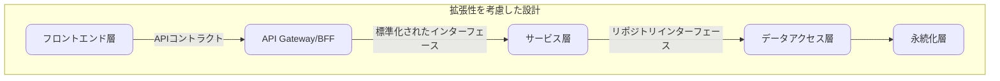

# 桜井政博に学ぶ ビジネスアプリケーション開発の極意
#### 〜ゲームデザインの天才に教わるビジネスシステム開発のセオリー〜

---

## はじめに

「星のカービィ」や「大乱闘スマッシュブラザーズ」を手がけた伝説のゲームデザイナー、桜井政博氏。彼のYouTubeシリーズ「桜井政博のゲームを作るには」には、40年以上にわたるゲーム開発の知恵が詰まっています。

一見、ゲーム開発とビジネスアプリケーション開発は別世界のように思えるかもしれません。しかし、「ユーザーに価値を届けるソフトウェアを作る」という本質は同じです。実は桜井氏の哲学と手法は、システムエンジニアの日常業務に驚くほど応用可能なのです。

本書は、桜井政博氏のゲーム開発の知恵をビジネスアプリケーション開発の文脈に翻訳したガイドブックです。エンタープライズシステムの開発現場で活躍する若手エンジニアの皆さんに、技術だけでなく「ユーザーに喜ばれるシステム」を作るためのマインドセットと実践的なアプローチをお届けします。

あなたのデスクに置いておける、疲れたときに開けば元気がでる、そんな一冊を目指しました。さぁ、桜井政博氏と一緒にビジネスアプリケーション開発の旅に出かけましょう！

---

## 目次

1. [ユーザー中心設計の原則](#1-ユーザー中心設計の原則)
2. [インターフェース設計と使い勝手](#2-インターフェース設計と使い勝手)
3. [アーキテクチャとパフォーマンス](#3-アーキテクチャとパフォーマンス)
4. [品質保証とデバッグ](#4-品質保証とデバッグ)
5. [プロジェクト管理と意思決定](#5-プロジェクト管理と意思決定)
6. [継続的改善と拡張性](#6-継続的改善と拡張性)
7. [ステークホルダーとの協働](#7-ステークホルダーとの協働)
8. [クリエイティブな問題解決](#8-クリエイティブな問題解決)
9. [あとがき：あなたの成長のために](#9-あとがき-あなたの成長のために)

---

## 1. ユーザー中心設計の原則

### 業務の真の目的を理解する

桜井政博氏は「大乱闘スマッシュブラザーズ」の開発において、常に「プレイヤーが何を楽しみたいのか」を最優先に考えてきました。これはビジネスアプリケーション開発にも直接通じる姿勢です。

> 🎮 **桜井語録**：「結局のところ、プレイヤーは『楽しさ』を求めてゲームを手に取る。華やかなグラフィックや最新テクノロジーは手段であって目的ではない。」

ビジネスアプリケーションのユーザーも、「美しいUI」や「最新技術」を求めているわけではありません。彼らが真に求めているのは「業務の効率化」「意思決定の質の向上」「ストレスなく仕事を完了できること」です。

**実践ポイント**：
- 要件定義の前に、ユーザーの業務内容を現場で観察する
- 「なぜその作業が必要か」のビジネス的理由を理解する
- 表面的な要望の背後にある本質的なニーズを掘り下げる

#### ケーススタディ：受注管理システム改善
あるメーカーの受注管理システム刷新プロジェクトで、営業担当者は「もっと早く注文情報を入力したい」という要望を出していました。開発チームが現場観察を行ったところ、実は彼らは顧客訪問中に手書きでメモを取り、オフィスに戻ってからシステムに入力していたのです。本当の課題は「入力速度」ではなく「二度手間」でした。

その結果、タブレットでの簡易入力アプリを開発し、顧客先でも最小限の情報を記録できるようにしました。これにより、オフィスでの再入力の手間が削減され、ユーザー満足度が大幅に向上したのです。

### 直感的な操作感を設計する

桜井氏のゲームは「説明書を読まなくても遊べる」直感性で知られています。この原則はビジネスアプリにも不可欠です。

> 🎮 **桜井語録**：「良いゲームは、プレイヤーに『次に何をすべきか』を自然に理解させる。押すべきボタンが光っていたり、進むべき道が少し明るくなっていたり...そういった小さなヒントが重要なんです。」

どんなに機能が充実していても、使い方が複雑すぎるシステムは現場で敬遠されます。特に頻繁に使用する機能ほど、シンプルで直感的である必要があります。

**実践ポイント**：
- 業務フローに沿った画面遷移を設計する
- 初心者にも分かりやすいアフォーダンス（視覚的手がかり）を提供する
- 使用頻度の高い機能はワンクリックでアクセスできるようにする

#### 実例：直感的なフォーム設計
ある保険会社のシステムでは、申込フォームの入力項目が50以上あり、ユーザーにとって大きな負担となっていました。改善プロジェクトでは以下のアプローチを取りました：

1. 入力項目を論理的なグループに分割
2. 条件付き表示で、関連する場合のみ表示される項目を設定
3. 入力中の項目に関連するヘルプ情報をコンテキストに応じて表示
4. 必須項目と任意項目の視覚的区別を明確化

結果、入力エラーが70%減少し、フォーム完了率が2倍になりました。

### フィードバックの設計

桜井氏はゲームにおけるフィードバックの重要性を常に強調しています。ビジネスアプリでも、ユーザーの操作に対する適切なフィードバックは不可欠です。

> 🎮 **桜井語録**：「ヒット感が重要です。プレイヤーの行動が世界に影響を与えたと感じられることが、満足感につながります。エフェクト、サウンド、振動...全ての要素が協調して、その瞬間を強調するのです。」

ビジネスアプリケーションでも、「システムが自分の操作を認識している」という安心感をユーザーに提供することが重要です。

**実践ポイント**：
- 処理中はローディング表示を明確に示す
- 成功・失敗時のメッセージは具体的かつ対処法を含める
- 重要な操作（削除など）は確認画面と取り消しの機会を設ける
- 長時間処理の場合は進捗状況を表示する

#### 実装例：フィードバックの工夫
```javascript
// 悪い例：フィードバックが不十分
function submitForm() {
  // データ送信処理
  api.sendData(formData);
}

// 良い例：ユーザーに適切なフィードバック
async function submitForm() {
  try {
    // フィードバック開始
    showLoadingIndicator();
    updateStatusMessage("データを送信中...");
    
    // データ送信処理
    const result = await api.sendData(formData);
    
    // 成功時のフィードバック
    showSuccessAnimation();
    updateStatusMessage("送信完了！レポートID: " + result.id);
    
    // 次のステップのガイダンス
    showNextStepGuidance();
  } catch (error) {
    // エラー時のフィードバック
    showErrorAnimation();
    updateStatusMessage("エラーが発生しました: " + error.message);
    suggestRecoveryAction(error.code);
  } finally {
    // ローディング表示終了
    hideLoadingIndicator();
  }
}
```

## 2. インターフェース設計と使い勝手

### 情報の優先順位付け

桜井氏は「大乱闘スマッシュブラザーズ」で常に画面上の「情報の優先順位」を考えてきました。複雑な対戦ゲームでも情報が整理され、プレイヤーが混乱しないUI設計が特徴です。

> 🎮 **桜井語録**：「画面上の全ての要素は優先順位を持っています。プレイヤーの視線をどこに誘導するか、何を最も目立たせるか、それを考え抜かなければなりません。」

ビジネスアプリケーションのUIも同様に、膨大な情報の中から「今、ユーザーが必要としている情報」を優先的に表示することが重要です。

**実践ポイント**：
- 業務上最も重要な情報・アクションを画面の目立つ位置に配置
- データの視覚的階層を作り、重要度に応じた表示サイズ・コントラストを設定
- ユーザーの作業コンテキストに応じて表示情報を変化させる
- 詳細情報は必要に応じて展開できる設計に

#### ビフォーアフター：ダッシュボード改善例

**改善前**：ある企業の営業管理ダッシュボードは、売上グラフ、顧客リスト、タスクリスト、ニュースフィード、通知など様々な情報が同じ視覚的重みで表示されていました。ユーザーは重要な情報を見つけるのに時間がかかっていました。

**改善後**：
1. ユーザーの役割（営業マネージャー/セールスレップ）に応じた異なるダッシュボードレイアウト
2. KPI指標を画面上部に大きく表示し、目標達成度を視覚的に強調
3. 期限切れタスクと重要顧客情報に視覚的優先度を与える
4. 二次的情報（ニュースなど）はタブで切り替え可能に変更

結果、ユーザーは平均28秒早く重要情報にアクセスできるようになりました。

### エラーに対する寛容さ

桜井氏のゲームは「初心者にも優しい」設計で知られています。プレイヤーのミスを過度に罰せず、学習と成長を促すアプローチです。

> 🎮 **桜井語録**：「カービィシリーズでは、落下してもすぐに戻れる仕組みを取り入れています。プレイヤーの挑戦を促すためには、失敗のコストを適切に設定することが重要です。」

ビジネスアプリケーションにおいても、ユーザーエラーへの対応は使い勝手を大きく左右します。

**実践ポイント**：
- 破壊的操作（削除など）には確認と復元機能を設ける
- エラーメッセージは非技術的な言葉で原因と対処法を説明
- 入力データのバリデーションはリアルタイムで行い、早期にフィードバック
- 「取り消し」「やり直し」機能を積極的に実装

#### 事例：フォーム入力改善
ある人事システムの長大な申請フォームでは、1つのエラーでも全項目の再入力が必要でした。改善後は：

1. 入力中のバリデーションでエラーを早期に通知
2. エラー項目のみハイライトし、正しい入力例を表示
3. セッション中のデータ自動保存で再読み込み時も入力を維持
4. 複数のエラーをまとめて表示し、優先度順に修正を案内

結果、フォーム完了率が45%向上し、ユーザーサポート問い合わせが62%減少しました。

### 学習曲線の設計

桜井氏のゲームは「簡単に始められて、奥深く極められる」学習曲線が特徴です。これはビジネスアプリケーションにも応用できる考え方です。

> 🎮 **桜井語録**：「大乱闘スマッシュブラザーズでは、ボタンを連打するだけでも必殺技が出せますが、タイミングやコンボを習得することで、より高度なプレイが可能になります。初心者から上級者まで、全てのプレイヤーが楽しめる奥行きが重要です。」

ビジネスアプリケーションも同様に、初心者には基本機能で業務が遂行でき、熟練者には高度な機能やショートカットを提供する設計が理想的です。

**実践ポイント**：
- 基本機能は画面上に明示し、直感的に操作できるようにする
- 中〜上級者向け機能は段階的に導入し、発見可能にする
- ショートカットキーやクイックアクセス機能を充実させる
- 「今日のヒント」などで定期的に新機能を紹介する

#### 実例：CRMシステムの学習曲線設計
あるCRMシステムのリニューアルでは、ユーザーの熟練度に応じた機能提供を意識して設計されました：

**初心者向け（導入1週間以内）**：
- 簡略化されたダッシュボード
- ガイド付きのウォークスルーチュートリアル
- 限定された基本機能セット

**中級者向け（1ヶ月〜3ヶ月）**：
- 高度な検索・フィルタリング機能の紹介
- レポート作成ウィザードの提供
- カスタマイズオプションの段階的解放

**上級者向け（3ヶ月以上）**：
- APIアクセスとデータエクスポート機能
- 高度な自動化ルールの設定
- カスタムダッシュボードビルダー

結果として、新規ユーザーの習熟期間が平均2週間短縮され、上級ユーザーの機能活用率も35%向上しました。

## 3. アーキテクチャとパフォーマンス

### レスポンスを最優先する

桜井氏は「ゲームの操作感は1フレームの遅延でも台無しになる」と述べ、パフォーマンスを最優先事項としています。

> 🎮 **桜井語録**：「グラフィックがいくら綺麗でも、操作に遅延があればプレイヤーはストレスを感じます。特にアクションゲームでは、入力からの反応速度が命です。派手な演出よりもレスポンスを優先する判断が必要な場面は多々あります。」

ビジネスアプリケーションでも、レスポンス速度はユーザー体験の根幹を成します。特にトランザクション処理や検索など、頻繁に使用される機能のパフォーマンスは最優先で最適化すべきです。

**実践ポイント**：
- ユーザーインターフェースのレスポンスは100ms以内を目標に
- データの事前読み込みと適切なキャッシュ戦略の実装
- 処理が1秒を超える場合は必ずプログレスインジケータを表示
- パフォーマンス目標を明確に定義し、定期的に測定する

#### 実例：検索機能の最適化
ある在庫管理システムでは、検索機能のレスポンスが2〜3秒かかり、現場作業員のストレスになっていました。最適化プロジェクトでは：

1. インデックス設計の見直しと全文検索エンジンの導入
2. タイプアヘッド検索で入力中から候補表示
3. よく使われる検索をキャッシュ
4. 検索結果の段階的読み込み実装

結果、平均検索時間が0.4秒に短縮し、作業効率が大幅に向上しました。

### 技術的負債と向き合う

桜井氏はシリーズ作品の開発において、「過去の遺産」と「新しい挑戦」のバランスを取ることの難しさを語っています。

> 🎮 **桜井語録**：「新作を開発するとき、過去のコードをすべて捨てて一から作り直したい誘惑がありますが、それは現実的ではありません。重要なのは『何を残し、何を変えるか』の見極めです。」

長期運用されるビジネスアプリケーションでも、技術的負債は避けられない課題です。完全なリライトはリスクが高いため、計画的に負債を返済していく戦略が重要です。

**実践ポイント**：
- 「技術的負債マップ」を作成し、影響度と対応コストで優先順位付け
- 新機能開発と並行して計画的にリファクタリングを実施
- 自動テストカバレッジを高め、安全なリファクタリングを可能に
- レガシーコードへの依存を徐々に減らす移行戦略の立案

#### ケーススタディ：レガシーシステム移行
ある製造業の基幹システムは20年以上運用された老朽化したCOBOLシステムでした。ビッグバン方式での置き換えはリスクが高すぎるため、以下のアプローチで段階的移行を実施しました：



1. 最初にAPIレイヤーを構築し、レガシーシステムをラップ
2. 新しいフロントエンドから徐々にAPIを通じてレガシー機能にアクセス
3. バックエンド機能を優先度の高いものから順次マイクロサービス化
4. データ移行は並行稼働期間を設け、整合性を検証しながら実施

結果、業務を止めることなく3年かけて完全移行を達成し、新システムでは処理速度が5倍に向上しました。

### スケーラビリティの設計

桜井氏は「大乱闘スマッシュブラザーズ」シリーズで、毎回増え続けるキャラクターやステージに対応できるアーキテクチャの重要性を学びました。

> 🎮 **桜井語録**：「最初の『スマブラ』を作った時は、まさか何十人ものキャラクターが参戦することになるとは思っていませんでした。後のシリーズでは拡張性を念頭に置いた設計が不可欠でした。」

ビジネスアプリケーションも同様に、将来の成長や変化に対応できる柔軟なアーキテクチャが重要です。特にユーザー数の増加、データ量の増大、機能の追加などに耐えうる設計が求められます。

**実践ポイント**：
- 水平スケーリングを前提としたステートレス設計
- データベースのシャーディング戦略の計画
- マイクロサービスアーキテクチャの適切な粒度設計
- キャッシュ層の効果的な活用

#### アーキテクチャ例：スケーラブルなWebアプリケーション



#### マイクロサービスアーキテクチャの実践例



この設計では、各層を独立してスケールアウトできます。特に負荷の高い特定のサービスだけを増強することも可能です。

## 4. 品質保証とデバッグ

### 徹底したテスト文化

桜井氏のゲームは品質の高さで知られており、特に「大乱闘スマッシュブラザーズ」では数百人のテスターが様々な条件でテストを行います。

> 🎮 **桜井語録**：「ゲームは無限の状況が発生し得るシステムです。開発者が想定していないプレイスタイルや組み合わせで遊ぶプレイヤーも多い。だからこそ、考えられる限りのパターンをテストすることが重要なんです。」

ビジネスアプリケーションも同様に、様々なユースケースやエッジケースを想定したテストが不可欠です。特にミッションクリティカルなシステムでは、品質は妥協できない要素です。

**実践ポイント**：
- 自動テスト（単体/統合/E2E）の網羅的な実装
- ユーザーストーリーに基づいたシナリオテスト
- パフォーマンステストと負荷テストの定期的実施
- 実際のユーザーによるUAT（ユーザー受け入れテスト）の重視

#### テスト戦略の例：多層的アプローチ

**単体テスト（70%）**：
- 基本的なビジネスロジックのカバレッジ
- 入力バリデーションと例外処理
- 計算ロジックの正確性

**統合テスト（20%）**：
- APIエンドポイントの振る舞い
- データベース操作の整合性
- マイクロサービス間の連携

**E2Eテスト（10%）**：
- 重要業務フローの完全な検証
- ユーザーインターフェースの操作性
- バックエンドとの連携

この比率はピラミッド型のテスト戦略に基づき、基盤となる単体テストに最も注力しつつ、統合テストとE2Eテストで全体的な品質を確保します。

### エッジケースとユーザーの創造性

桜井氏は「プレイヤーは開発者の想像を超える行動をする」と常に警鐘を鳴らしています。

> 🎮 **桜井語録**：「どんなに考え抜いても、プレイヤーは予想外の遊び方を発見します。それが時にはバグになり、時には新たな楽しみ方になる。開発者は常に『想定外』を想定しなければなりません。」

ビジネスアプリケーションのユーザーも同様に、想定外の使い方を見つけ出します。特にデータ入力やワークフローにおいて、エッジケースを徹底的に考慮することが重要です。

**実践ポイント**：
- 「この機能を悪用するには？」という視点でのセキュリティテスト
- 極端なデータ入力（非常に大きな数値、特殊文字など）の処理
- 予期せぬユーザー行動（順序の入れ替え、同時操作など）への対応
- 実際の現場観察からエッジケースを収集

#### 事例：予期せぬユーザー行動への対応
ある経費申請システムでは、開発者が想定していなかった以下のユーザー行動が発見されました：

1. 同一申請を複数回提出（「送信」ボタンの連打）
2. 承認プロセス中に申請内容を編集
3. ブラウザの「戻る」ボタンで前の画面に戻り再編集
4. 画像添付時に非常に高解像度の写真をアップロード

これらの問題に対処するため：
- 二重送信防止のトークン実装
- オブジェクトロックによる同時編集防止
- 状態管理の強化とブラウザ履歴の適切な制御
- 画像のサイズ・解像度の自動調整機能

### デバッグの技術と心構え

桜井氏は「バグを見つけることは宝物を見つけるようなもの」という姿勢でデバッグに取り組んでいます。

> 🎮 **桜井語録**：「バグを見つけた時、『なぜこうなるのか』を深く理解することが重要です。表面的な修正だけでは、同様の問題が別の形で再発します。根本原因を追求する粘り強さがデバッグには必要です。」

ビジネスアプリケーション開発でも、効果的なデバッグは単なる技術だけでなく、問題の本質を探る探究心が重要です。

**実践ポイント**：
- 再現手順の明確な文書化と共有
- ロギングとモニタリングの充実による情報収集
- 「なぜ？」を5回繰り返す根本原因分析
- デバッグ環境と本番環境の差異を最小化

#### デバッグチェックリスト
問題発生時の効果的なアプローチ：

1. **問題の明確な定義**
   - 何が起きているか？
   - 期待する動作は？
   - いつから発生しているか？
   - どのような条件で発生するか？

2. **情報収集**
   - ログを確認（エラーメッセージ、タイミング）
   - 環境情報（ブラウザ、OS、デバイス）
   - 関連する変更（最近のデプロイ、設定変更）
   - ユーザーの行動シーケンス

3. **仮説と検証**
   - 考えられる原因のリストアップ
   - 最も可能性の高い仮説から検証
   - 小さな変更で仮説を検証
   - 変更の影響を隔離して確認

4. **解決と検証**
   - 修正の実装
   - 元の問題が解決したことを確認
   - 副作用が生じていないことを確認
   - 同様の問題が他の場所で発生していないか確認

5. **知識の共有**
   - 原因と解決策の文書化
   - チームでの共有と学び
   - 将来の防止策（テスト追加など）

## 5. プロジェクト管理と意思決定

### スコープとリソースのバランス

桜井氏は限られた開発期間とリソースの中で、どの機能に注力するかの判断に苦心してきました。

> 🎮 **桜井語録**：「すべての機能を完璧に作り込むことは不可能です。重要なのは『どの機能に時間をかけるべきか』の判断。プレイヤーが最も触れる部分、ゲームの核となる部分に十分なリソースを確保することが鍵です。」

ビジネスアプリケーション開発でも、すべての要望を満たすことは現実的ではありません。限られたリソースを最も価値のある機能に集中させることが重要です。

**実践ポイント**：
- ビジネスインパクトとユーザー価値に基づく機能の優先順位付け
- MVPアプローチによる核となる機能の早期リリース
- 80/20の法則を意識（20%の機能が80%の価値を生む）
- 「今回は見送る機能」の明確化と合意形成

#### プロジェクト優先順位付けマトリクス

| | 高ビジネス価値 | 低ビジネス価値 |
|---|---|---|
| **実装容易** | 優先実装（Quick Win） | 後回し |
| **実装困難** | 投資検討（要分析） | 見送り |

この単純なマトリクスを使用することで、限られたリソースをどの機能に投入すべきかを視覚化できます。

### 意思決定とリーダーシップ

桜井氏は「大乱闘スマッシュブラザーズ」の開発において、多くの意見がある中で最終判断を下す責任を負ってきました。

> 🎮 **桜井語録**：「良いゲームを作るには、様々な意見に耳を傾けることが大切ですが、最終的には誰かが決断を下さなければなりません。委員会による決定では、ビジョンが曖昧になりがちです。」

ビジネスアプリケーション開発でも、プロジェクトの方向性に関する明確な意思決定は成功の鍵です。特に様々なステークホルダーの意見が対立する場面では、リーダーシップが試されます。

**実践ポイント**：
- 意思決定の基準を事前に明確化（プロジェクトの目標、制約条件など）
- データと根拠に基づく決断
- 決定事項と理由の透明な共有
- 決断後の一貫した方向性の維持

#### ケーススタディ：設計方針の対立
ある金融システムの開発で、UIデザインについて「使いやすさ重視」と「機能性重視」の2つの意見が対立していました。プロジェクトリーダーは以下のアプローチで解決しました：

1. ユーザーリサーチを実施し、実際のニーズを客観的に把握
2. ユーザーペルソナを作成し、主要ユーザー層を明確化
3. プロトタイプA/Bテストで両アプローチを検証
4. 定量・定性データに基づき最終決定

結果、特定の複雑な業務画面は機能性重視、一般ユーザー向け画面は使いやすさ重視という折衷案が採用され、プロジェクトは目標を達成しました。

### フィードバックサイクルの構築

桜井氏はゲーム開発において、早期から遊べる状態にして繰り返しテストとフィードバックを得ることの重要性を説いています。

> 🎮 **桜井語録**：「ゲームは遊んでみないと面白いかどうかわかりません。だから私たちは開発の早い段階から、粗くても遊べる形にして、チーム内でプレイテストを繰り返します。理論だけで作れるものではないのです。」

ビジネスアプリケーション開発でも、実際のユーザーフィードバックを早期から取り入れることで、方向性の軌道修正や品質向上が可能になります。

**実践ポイント**：
- プロトタイプやモックアップを用いた早期フィードバック収集
- アジャイル開発手法による短期反復サイクルの実施
- ベータユーザープログラムの活用
- フィードバックを基に優先順位を継続的に見直す

#### フィードバックサイクル実施例

**初期段階（要件定義時）**：
- ペーパープロトタイプやワイヤーフレームでユーザーインタビュー
- 主要ユースケースのウォークスルー

**開発中（スプリント単位）**：
- 2週間ごとのデモと関係者レビュー
- ユーザビリティテストと改善点の収集

**リリース前**：
- 限定ユーザーによるベータテスト
- フィードバックに基づく最終調整

**リリース後**：
- ユーザー行動分析とヒートマップ
- サポート問い合わせからの課題抽出
- NPS（Net Promoter Score）測定

## 6. 継続的改善と拡張性

### 未来を見据えた設計

桜井氏は「大乱闘スマッシュブラザーズ」シリーズにおいて、将来の拡張を見据えたシステム設計の重要性を学びました。

> 🎮 **桜井語録**：「初代『スマブラ』を作った時は、まさか何世代にもわたってシリーズが続くとは思っていませんでした。新しいハードウェア、新キャラクター、新モード...後のシリーズでは拡張性を念頭に置いた設計が不可欠になりました。」

ビジネスアプリケーションも同様に、長期運用を見据えた拡張性のある設計が重要です。特に基幹システムは10年以上使われることも珍しくないため、将来の要件変更に柔軟に対応できる設計が求められます。

**実践ポイント**：
- 疎結合なモジュール設計と明確なインターフェース定義
- データモデルの柔軟性（後から項目追加できる設計）
- サードパーティ連携のためのAPIファースト設計
- 設定による機能カスタマイズ（ハードコーディングを避ける）

#### アーキテクチャ例：拡張性を考慮した設計


このように層を分離し、各層間のインターフェースを標準化することで、個別の層を変更・拡張しても他の層への影響を最小限に抑えられます。

### バージョンアップと後方互換性

桜井氏はシリーズ作品の開発において、新機能の追加と既存要素との調和に苦心してきました。

> 🎮 **桜井語録**：「新作では革新的な要素を入れたいという欲求がありますが、同時にファンが愛する要素も残さなければなりません。この『古いものと新しいものの調和』が続編開発の最大の難しさです。」

ビジネスアプリケーションのアップデートにおいても、新機能の追加と既存ユーザーの混乱防止のバランスは重要な課題です。特に基幹システムでは、後方互換性の維持が業務継続の鍵となります。

**実践ポイント**：
- APIのバージョニング設計（複数バージョンの並行サポート）
- 段階的な機能移行と古いインターフェースの非推奨化プロセス
- データマイグレーション計画とロールバック戦略
- 新機能の段階的なロールアウト（カナリアリリース）

#### ケーススタディ：大規模UI刷新プロジェクト
ある会計システムの全面的UIリニューアルでは、急激な変更による混乱を避けるため、以下のアプローチを取りました：

1. **並行稼働期間の設定**
   - 3カ月間、新旧インターフェースを切り替え可能に設定
   - ユーザーが自分のペースで新UIに慣れる機会を提供

2. **段階的な機能移行**
   - 最初は基本機能のみを新UIで提供
   - 利用データに基づき、使用頻度の低い機能を後から移行

3. **トレーニングとサポート強化**
   - 移行ガイドとビデオチュートリアルの提供
   - 新UIに関する質問専用のヘルプデスク設置

4. **フィードバックループ**
   - ユーザーからの改善要望を積極的に収集
   - 重要な問題点に対する迅速なイテレーション

結果、業務の中断なく新UIへの完全移行を達成し、最終的にはユーザー満足度が向上しました。

### 保守性と技術的持続可能性

桜井氏は長期にわたるゲーム開発の経験から、持続可能な開発プロセスの重要性を説いています。

> 🎮 **桜井語録**：「一本のゲームを作るためには膨大な労力が必要です。しかし、それは一度きりのスプリントではなく、マラソンのように考えるべきです。持続可能なペースで高品質を維持することが、最終的には良い結果につながります。」

ビジネスアプリケーションの開発・保守においても、短期的な効率だけでなく長期的な持続可能性を考慮することが重要です。特に長寿命のシステムでは、保守性はコストと品質に直結します。

**実践ポイント**：
- 明確なコーディング規約とアーキテクチャガイドライン
- 包括的なドキュメント整備（特に設計判断の理由）
- 技術的負債の定期的な可視化と返済計画
- モジュール化と再利用可能なコンポーネント設計

#### 保守性チェックリスト

**コード品質**：
- 命名規則の一貫性
- 関数/メソッドの適切な粒度
- コメントと自己文書化コード
- 重複コードの最小化

**テスト容易性**：
- 単体テストのカバレッジ
- モック/スタブによるテスト分離
- 自動テストの実行時間最適化
- コードカバレッジレポート

**ドキュメント**：
- アーキテクチャ概要図
- 主要コンポーネントの責任範囲
- API仕様書
- データモデル説明

**運用性**：
- ログ出力の一貫性
- モニタリングポイントの設定
- アラート閾値の定義
- 障害時の復旧手順

## 7. ステークホルダーとの協働

### 要件の本質を捉える

桜井氏はキャラクターライセンスの交渉において、IP（知的財産）保有者の真の要望を理解することの重要性を学びました。

> 🎮 **桜井語録**：「他社のキャラクターを『スマブラ』に参戦させる際、表面的な要望だけでなく、そのキャラクターに対する愛情や大切にしている要素を理解することが重要でした。それがあってこそ、お互いが満足できるコラボレーションが実現します。」

ビジネスアプリケーション開発でも、クライアントやエンドユーザーの表面的な要望の背後にある本質的なニーズを理解することが成功の鍵です。

**実践ポイント**：
- 「なぜ？」を繰り返し、要望の根本原因を探る
- ユーザーの業務プロセス全体を理解する
- 現場観察とユーザーシャドウイングの実施
- 要件の優先順位付けにビジネス指標を活用

#### 要件分析テクニック：5つのWhyメソッド

**ケース例**：営業部門から「顧客データの一覧エクスポート機能が欲しい」という要望

**1. なぜエクスポート機能が必要ですか？**  
「顧客別の売上分析をするためです」

**2. なぜシステム内で分析できないのですか？**  
「現在のシステムには柔軟な集計機能がないからです」

**3. なぜExcelで分析する必要があるのですか？**  
「四半期ごとに異なる切り口での分析が必要で、その都度システム改修を待てないからです」

**4. なぜ四半期ごとに異なる分析が必要なのですか？**  
「経営陣に提出するレポートの要件が四半期ごとに変わるからです」

**5. なぜレポート要件が変わるのですか？**  
「市場状況に応じて注目すべき指標が変わるためです」

この分析から、本質的なニーズは「柔軟なレポート作成機能」であることが分かります。単純なエクスポート機能ではなく、ユーザー自身がカスタマイズ可能なレポートビルダーの実装が最適解かもしれません。

### コミュニケーションと期待値管理

桜井氏は「大乱闘スマッシュブラザーズ」の発表において、ファンとの適切なコミュニケーションの重要性を学びました。

> 🎮 **桜井語録**：「新キャラクターの発表は非常に重要なイベントです。ファンの期待を裏切らないよう、何をいつ伝えるか、どのように見せるかを細心の注意を払って計画します。期待値のコントロールは、満足度に直結します。」

ビジネスアプリケーション開発でも、ステークホルダーとの適切なコミュニケーションと期待値管理は成功の重要な要素です。

**実践ポイント**：
- プロジェクト初期に明確な目標と制約の合意
- 定期的な進捗報告と早期の問題共有
- 「できること」と「できないこと」の誠実な説明
- デモとプロトタイプを活用した具体的なイメージ共有

#### 期待値管理のためのコミュニケーションプラン

**キックオフ段階**：
- プロジェクトスコープと目標の明文化
- マイルストーンと成果物の定義
- リスクと前提条件の共有
- 意思決定プロセスの合意

**進行中**：
- 週次/隔週の進捗レポート
- 視覚的な進捗ダッシュボードの共有
- 課題の早期エスカレーションルート
- 変更要求の評価プロセス

**リリース前**：
- 詳細なリリーススケジュール
- トレーニング計画と移行戦略
- 初期制限事項とロードマップ
- サポート体制の説明

### クリエイティブな妥協点の見つけ方

桜井氏は限られたリソースと多様な要望の間で、創造的な妥協点を見つける術に長けています。

> 🎮 **桜井語録**：「理想通りに全てを実現することはほぼ不可能です。大切なのは『どこで妥協するか』ではなく『どう創造的に解決するか』です。制約があるからこそ生まれる革新もあるのです。」

ビジネスアプリケーション開発でも、予算、期間、技術的制約の中で最大の価値を届けるための創造的な解決策を見つけることが重要です。

**実践ポイント**：
- 「完璧より良い解決策」の思考法
- 段階的リリース計画（まず核心価値を届け、順次拡張）
- 代替アプローチの積極的な模索
- 「今は実装しない」という選択肢も含めた判断

#### ケーススタディ：制約下での創造的解決
ある医療システムの開発では、予算制約から当初予定していた複雑な画像処理機能の実装が困難になりました。開発チームは以下の創造的妥協を提案：

**当初計画**：
- 独自の医療画像処理エンジン開発
- システム内での高度な画像解析
- AIによる自動診断支援機能

**創造的妥協案**：
1. 既存のオープンソース画像ビューアを統合
2. クラウドAPIを活用した画像解析（従量課金モデル）
3. 自動診断機能はフェーズ2に延期し、まずはシンプルな閲覧・管理機能を提供
4. 将来の拡張を見据えたAPIとデータモデルの設計

この提案により、核となる機能は予定通りリリースでき、コスト効率も大幅に向上。また、実際のユーザーフィードバックを基に、次フェーズでの機能優先順位を再検討できるようになりました。

## 8. クリエイティブな問題解決

### 固定観念を超える発想

桜井氏は常に「当たり前」を疑い、新しいゲーム体験を創造してきました。特に「大乱闘スマッシュブラザーズ」は格闘ゲームの常識を覆した革新的タイトルでした。

> 🎮 **桜井語録**：「『こうあるべき』という先入観は創造性の敵です。私は常に『なぜそうなっているのか』を問い直します。その問いから新しいアイデアが生まれることが多いのです。」

ビジネスアプリケーション開発でも、業界の常識や従来のアプローチにとらわれない発想が、真の革新を生み出します。

**実践ポイント**：
- 「なぜこの方法なのか」を根本から問い直す
- 異なる業界のベストプラクティスを参考にする
- デザイン思考ワークショップの実施
- ユーザーの「痛点」に焦点を当てた根本的解決策の模索

#### ケーススタディ：固定観念を覆した在庫管理アプローチ
ある小売業の在庫管理システム刷新プロジェクトで、開発チームは従来の「定期棚卸し」という概念を根本から問い直しました。

**従来のアプローチ**：
- 月次の全商品棚卸し
- 手動カウントと在庫システムの照合
- 大量の差異調査と修正

**新しい発想**：
- AIカメラによる商品認識と常時在庫モニタリング
- 商品移動ごとのリアルタイム追跡
- 異常検知時のみ人間による確認

この発想の転換により、棚卸し作業の工数が95%削減され、在庫精度が向上。さらに商品の位置情報も把握できるようになり、ピッキング効率も大幅に改善しました。

### ユーザー体験の再定義

桜井氏は「操作感」や「フィードバック」など、細部にこだわることでゲーム体験を常に進化させてきました。

> 🎮 **桜井語録**：「ゲームの本質は『体験』です。グラフィックやストーリーではなく、プレイしたときの感触、リアルタイムのフィードバック、達成感...これらの要素が記憶に残るゲーム体験を作り出します。」

ビジネスアプリケーションでも、単なる機能の集合ではなく、ユーザー体験全体を設計することで、真に価値のあるシステムが生まれます。

**実践ポイント**：
- ユーザージャーニーマップの作成と体験全体の可視化
- マイクロインタラクションの丁寧な設計
- 感情的側面（達成感、安心感など）の考慮
- 「ワークフロー」ではなく「ストーリー」としての体験設計

#### 体験設計の例：経費申請プロセスの再定義

**従来の経費申請体験**：
1. 経費が発生
2. レシートを保管
3. オフィスに戻る
4. 経費申請フォームに記入
5. レシートをスキャン/添付
6. 申請提出
7. 承認を待つ
8. （差し戻しの場合）修正して再提出
9. 最終承認
10. 支払い処理

**再定義された経費申請体験**：
1. 経費発生時にスマホアプリでレシート撮影
2. AIがレシートから情報を自動抽出
3. 不足情報のみ簡単に補完
4. ワンタップ提出
5. 承認状況のリアルタイム通知
6. 承認完了・支払い予定日の通知

この再定義により、ユーザーの体験はシンプルで直感的になり、全体のプロセスも効率化されました。重要なのは、単に「ステップ数を減らす」だけでなく、「ユーザーの負担と不安を軽減する」という体験全体の質的向上です。

### 持続的なイノベーション文化

桜井氏は長年にわたり、革新性と安定性のバランスを取りながらゲーム開発を続けてきました。

> 🎮 **桜井語録**：「イノベーションは一瞬のひらめきではなく、日々の小さな改善の積み重ねでもあります。完璧を目指すよりも、常に良くしようとする姿勢が大切です。」

ビジネスアプリケーション開発のチームにも、持続的なイノベーション文化を根付かせることが、長期的な成功につながります。

**実践ポイント**：
- 「改善提案」を奨励する文化作り
- 定期的なイノベーションワークショップ
- 失敗を許容し、学びを共有する場の設定
- 新技術の探索と実験のための時間確保

#### イノベーション促進の実践例

**20%ルール**：
チームメンバーの業務時間の20%を個人的な探求や改善活動に充てることを公式に認める。これにより、日常業務では取り組めない革新的なアイデアの種が育つ環境を作る。

**改善提案システム**：
どんな小さな改善アイデアでも提案できるシステムを用意し、定期的に投票で実装するアイデアを選定。提案者がリードして小チームで実装を進める。

**ハッカソン**：
四半期に一度、2日間の社内ハッカソンを開催。通常のプロジェクト制約から離れ、革新的なアイデアに取り組む機会を提供。成果は全社で共有し、有望なものはプロダクトロードマップに組み込む。

**失敗学習会**：
うまくいかなかったプロジェクトや機能について、非難なしに振り返り、学びを共有するセッションを定期的に開催。これにより「挑戦→失敗→学習→成長」のサイクルを促進する。

## 9. あとがき：あなたの成長のために

システムエンジニアとしてのキャリアにおいて、技術的なスキルは必要条件ですが、十分条件ではありません。真に優れたエンジニアになるためには、桜井政博氏が体現してきたような「ユーザーへの共感」「品質へのこだわり」「創造的な問題解決」といったマインドセットが不可欠です。

ゲーム開発とビジネスアプリケーション開発は、表面的には異なる世界のように見えますが、本質は同じです。どちらも「人間のためのソフトウェア」を作ることであり、その目的は「ユーザーに価値を届けること」にあります。

桜井氏の言葉を借りれば：

> 🎮 **桜井語録**：「良いものを作るために必要なのは、高度な技術だけではありません。使う人の立場になって考える想像力、妥協せず細部にこだわる姿勢、そして何より『良いものを作りたい』という情熱です。」

この言葉は、ビジネスアプリケーション開発においても真理と言えるでしょう。

皆さんがこの本から得た知恵を日々の開発現場で活かし、ユーザーに喜ばれる素晴らしいビジネスアプリケーションを生み出していくことを願っています。たとえ小さな改善からでも、その積み重ねが大きな違いを生み出すのです。

システムエンジニアとしての皆さんの旅に、桜井政博氏の知恵が寄り添い、新たな視点と情熱をもたらしてくれることを願っています。

---

**著者について**

本書は桜井政博氏のYouTubeシリーズ「桜井政博のゲームを作るには」の哲学と方法論を、ビジネスアプリケーション開発の文脈に翻訳・再編したものです。著者はエンタープライズソフトウェア開発の現場で15年以上の経験を持ち、ゲーム開発の知見をビジネスシステムに応用する独自のアプローチを研究・実践しています。

---

**参考文献**

* 桜井政博. (2021-現在). 桜井政博のゲームを作るには. YouTube.
* Sakurai, M. (2021-present). Masahiro Sakurai on Creating Games. YouTube.
* Norman, D. A. (2013). The Design of Everyday Things: Revised and Expanded Edition.
* Gothelf, J., & Seiden, J. (2013). Lean UX: Applying Lean Principles to Improve User Experience.
* Martin, R. C. (2017). Clean Architecture: A Craftsman's Guide to Software Structure and Design.

---
